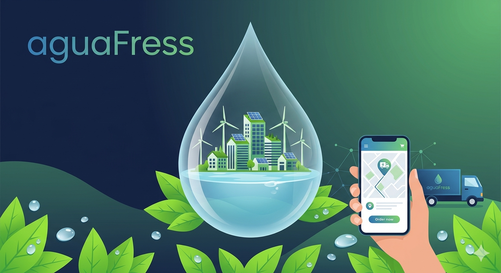

# aguaFress

aguaFress resuelve la pérdida de ventas y los viajes improductivos de los vendedores de agua y soda, permitiendo pedidos on-demand y confirmación de visitas para optimizar rutas, ahorrar combustible y reducir emisiones — diseñado para vendedores locales en Cipolletti y zonas urbanas similares.

---

## Qué problema resuelve aguaFress

### Visitas improductivas
Evita que los vendedores realicen recorridos cuando el cliente aún tiene producto, reduciendo gastos de combustible y tiempo perdido.

### Ventas perdidas por falta de stock
Permite pedidos on-demand cuando el consumidor se queda sin agua o soda, aumentando ventas fuera del día de visita programada.

### Ineficiencia logística
Transforma rutas fijas en rutas diarias optimizadas basadas en pedidos reales, disminuyendo distancia recorrida y huella de carbono.

---

## Para quién es aguaFress

- Vendedores independientes y pequeñas distribuidoras de agua, sodas y gaseosas que realizan entregas puerta a puerta.
- Preventistas y choferes que buscan reducir visitas en vacío y optimizar su jornada.
- Consumidores residenciales y comercios pequeños que desean recibir reposiciones rápidas sin esperar la visita semanal.
- **Futuro objetivo V2.0:** proveedores mayoristas que quieran ofrecer pedidos web/móvil a sus clientes finales.

---

## Valor diferencial

### Confirmación de visita por el cliente
El consumidor recibe un aviso y confirma si necesita la entrega; si no confirma, la visita se omite, evitando viajes innecesarios.

### Pedidos on-demand integrados con planificación de rutas
Cada día se genera una ruta optimizada con entregas reales, no con visitas fijas. Esto aumenta ventas y reduce costos operativos.

### Enfoque sostenible
Menos kilómetros recorridos, menos combustible y menor huella de carbono; además facilita la gestión de retornos de envases para economía circular.

### Sencillez para vendedores no técnicos
Interfaz clara para confirmar y gestionar pedidos y rutas sin conocimientos técnicos.

---

# Pitch de 30 segundos

aguaFress es la plataforma para vendedores de agua y soda que convierte visitas semanales en entregas inteligentes. Los clientes confirman si necesitan reposición y pueden pedir on-demand cuando se quedan sin producto; el sistema genera rutas diarias optimizadas para entregar más, gastar menos y reducir emisiones.

**Resultado:** más ventas, menos viajes en vacío y ahorro real en combustible, todo con una app simple que cualquier vendedor puede usar.

